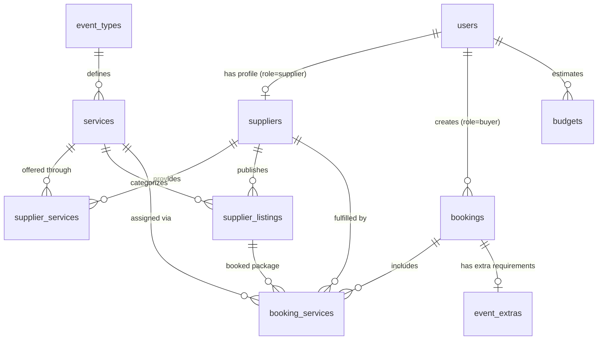

# EVENTFLARE — Premium Event Planning & Management Platform

[](https://www.php.net/)
[](https://www.mysql.com/)
[](#1-project-overview)
[](#2-features)
[-10B981)](#9-automated-testing--verification)

---

## 1. Project Overview

**EVENTFLARE** is a full-featured, responsive, dual-sided event planning marketplace and operations management system. Developed with modern PHP and MySQL, the application bridges the gap between **Event Clients (Buyers)** who want to discover, budget, and book celebrations, and **Event Suppliers (Vendors)** who offer event spaces, catering, decor, entertainment, and professional hospitality services.

The platform is designed around a cinematic **glassmorphism design language** (utilizing backdrop blur filters, gradient accents, and responsive flex/grid layouts) paired with an enterprise-grade administration and auditing back-office.

### Core Objectives
* **For Event Clients**: Explore curated event categories (Weddings, Get-Togethers, Birthdays, DJ Parties, Hotel Venues), calculate catering budgets in real time, place bookings with auto-generated reference IDs, track booking status updates, and export booking dossiers as PDF documents.
* **For Event Suppliers**: Self-register businesses across 10 service categories, manage vendor profiles and service capabilities, and maintain listing packages with flexible pricing structures (total package, per person, per hour, per day).
* **For System Administrators**: Monitor global event KPIs, manage event categories and service catalogs, assign suppliers to specific booking services, audit financial records, manage staff permissions, and process incoming customer inquiries.

### Intended Audience
* **Clients / Event Hosts**: Individuals and corporate planners organizing private or commercial events.
* **Suppliers / Service Providers**: Banquet managers, caterers, florists, audio/visual engineers, DJs, photographers, bakeries, security firms, and mixologists.
* **Event Coordinators & System Administrators**: Site managers and operational staff overseeing broker logistics and platform integrity.

---

## 2. Features

### 🤝 Dual-Sided Marketplace & Universal Authentication
* **Role-Based Redirection**: A unified sign-in portal (`public/Login.php`) inspects user roles upon password verification (`password_verify`) and automatically routes users to their corresponding dashboard:
  * `admin` $\rightarrow$ Administrative Control Console (`public/admin/Dashboard.php`)
  * `supplier` $\rightarrow$ Supplier Partner Portal (`public/supplier/Dashboard.php`)
  * `buyer` $\rightarrow$ Public Event Gallery & Reservation Portal (`public/Slide.php` / `public/MyBookings.php`)
* **Role Segregation**: Independent onboarding flows for buyers (`public/RegisterForm.php`) and suppliers (`public/supplier/Register.php`), plus a restricted administrative staff onboarding system (`public/admin/AdminStaff.php`).

### 💍 Wedding Planning & Previous Events Showcase (`public/events/WeddingsSlids.php`)
* **Real Past Celebrations Showcase**: Curated portfolio of completed weddings across 4 themes (*Traditional Poruwa*, *Coastal & Beachfront*, *Luxury Ballroom*, *Garden Romance*) with guest metrics, venue locations, and photo galleries.
* **Interactive Event Dossier Modal**: Inspect assigned vendor breakdowns (Poruwa florists, 4K cinematographers, cultural drummers, and caterers) with one-click "Book Similar Style" pre-fills.
* **Direct Vendor Packages & Catalog**: Real-time integration with `services` and `supplier_listings` showing transparent LKR pricing, guest capacities, and booking shortcuts.
* **4-Step Guided Planning Roadmap**: Guided journey connecting venue selection, live parametric food budgeting in `Food.php`, vendor matchmaking, and booking tracking in `MyBookings.php`.

### 📅 Client Booking Engine & Reservation Management
* **Instant Booking Generation**: Clients schedule events with specifications for event type, venue/location, guest capacity, event date (with validation enforcing current/future dates), day/night preference, food tier, and bespoke requirements.
* **Collision-Resistant Reference IDs**: Generates unique tracking codes formatted as `BKG<HEX_STRING>` (e.g., `BKG664E8AC91D33C`).
* **Interactive Client Dossier (`public/MyBookings.php`)**:
  * Real-time status indicators: `Pending`, `Confirmed`, `In Progress`, `Completed`, `Cancelled`.
  * Modal inspection for complete event dossiers including assigned suppliers and cost estimates.
  * Instant landscape PDF generation via client-side `html2pdf.js`.

### 💰 Dynamic Food & Catering Budget Calculator
* **Parametric Estimation (`public/Food.php`)**: Computes instant line-item and aggregate costs across 4 catering categories:
  $$\text{Total Spent} = (\text{Buffet Qty} \times \text{Price}) + (\text{Beverages Qty} \times \text{Price}) + (\text{Desserts Qty} \times \text{Price}) + (\text{Snacks Qty} \times \text{Price})$$
* **Variance Analysis**: Evaluates budget balance ($\text{Remaining} = \text{Food Budget} - \text{Total Spent}$) and variance flags.
* **Database Archival**: One-click persistence to the `budgets` table for cross-referencing against client bookings.

### 🏢 Supplier Portal & Inventory Management
* **Business Profile Editor (`public/supplier/Profile.php`)**: Allows vendors to configure trading names, categories, descriptions, phone contacts, physical locations, logos, and multi-select service offerings synchronized to the `supplier_services` junction table.
* **Listing Package Management (`public/supplier/Listings.php`)**: Full CRUD management of supplier service packages with price models (`total_package`, `per_person`, `per_hour`, `per_day`), capacity limits, cover image URLs, and active/inactive status switches.

### 🛡️ Administrative Control & Auditing Hub
* **Metrics Dashboard (`public/admin/Dashboard.php`)**: High-level platform telemetry tracking total registered users (buyers vs. suppliers), booking counts, pending requests, gross budgets, unread messages, and an interactive 12-month booking trend chart rendered via Chart.js.
* **Event Operations (`public/admin/Bookinglist.php`)**: Comprehensive booking management with status mutation controls, deletion actions, and a vendor assignment engine that attaches approved suppliers to specific sub-services with cost tracking.
* **Event Types & Service Catalog Manager (`public/admin/EventTypes.php`)**: Manage event categories and sub-services, define priority rankings, toggle service requirement flags (`is_required`), and set capacity benchmarks.
* **Financial Auditing Console (`public/admin/Budgets.php`)**: Financial audit log calculating total allocated funds, total expenditure, remaining balances, and budget variances, equipped with PDF export.
* **Inquiry Inbox (`public/admin/Messages.php`)**: Helpdesk message inbox supporting full-text search, read/unread filters, single-click status toggles, and bulk read operations.
* **Staff & Admin Administration (`public/admin/AdminStaff.php`)**: Manage authorized administrators with credential validation and CSRF protection.

### 🔒 Enterprise Security Middleware
* **Centralized Gatekeeper (`includes/admin_auth.php`)**: Restricts administrative routes, enforcing strict session validation.
* **Inactivity Timeout**: Automatically invalidates administrative sessions after 2 hours (7,200 seconds) of inactivity.
* **CSRF Protection**: Cryptographically secure token generation (`bin2hex(random_bytes(32))`) and timing-attack-safe validation (`hash_equals`).
* **SQL Injection Prevention**: All persistent queries utilize parameterized prepared statements (`mysqli::prepare`, `bind_param`).
* **XSS Sanitization**: User-supplied input is sanitized via `htmlspecialchars` across all rendering targets.

---

## 3. Technology Stack

| Layer | Technology | Description |
| :--- | :--- | :--- |
| **Backend Runtime** | **PHP 8.1+** | Object-Oriented and procedural PHP with native `mysqli` extension. |
| **Database** | **MySQL 8.0+ / MariaDB 10.4+** | Relational InnoDB storage engine with foreign keys and cascade rules. |
| **Styling & Design** | **Vanilla CSS3** | Custom Glassmorphism design tokens (CSS variables), Flexbox, and CSS Grid. |
| **Client Scripting** | **JavaScript (ES6+)** | Native asynchronous DOM scripting, modal controllers, and form validators. |
| **Data Visualization** | **Chart.js (v3+)** | Responsive canvas charts rendering monthly booking trends. |
| **Document Export** | **html2pdf.js (v0.9.2)** | Client-side HTML-to-PDF compilation for reports and receipts. |
| **Icons & Typography** | **Font Awesome 6.4.0 & Boxicons** | Modern iconography paired with Inter, Karla, and Roboto typography. |
| **Server Compatibility** | **Apache / Nginx / PHP CLI** | Compatible with Apache (`mod_rewrite`), Nginx, or PHP's built-in dev server. |

---

## 4. Project Structure

The project follows a modular directory layout separating public-facing entry points, administrative back-office routes, database migrations, shared includes, and automated test suites:

```text
Event-Planning-Management/
├── config/
│   └── database.php                 # MySQL connection configuration (mysqli connection handle)
├── includes/
│   ├── admin_auth.php               # Admin authentication middleware, CSRF tokens & session timeout
│   ├── admin_sidebar.php            # Unified admin console navigation with dynamic notification badges
│   └── navbar.php                   # Floating glassmorphic top navigation bar with role-aware links
├── public/
│   ├── assets/
│   │   ├── css/
│   │   │   ├── admin-dashboard.css  # Admin console styling (tables, modals, sidebar, badges)
│   │   │   ├── global.css           # Core design system tokens (colors, typography, glassmorphism)
│   │   │   └── ... (page styles)    # Dedicated stylesheets (Login, Booking, Food, Contact, etc.)
│   │   └── images/                  # High-resolution event imagery, backgrounds, and platform logo
│   ├── admin/
│   │   ├── Admin.php                # Dedicated admin console authentication gate
│   │   ├── AdminRegistation.php     # Admin registration form (restricted to existing admins)
│   │   ├── AdminStaff.php           # Staff administration & credential management
│   │   ├── Bookinglist.php          # Booking operations, status editor & supplier assignment
│   │   ├── BookinglistClient.php    # Backward compatibility redirect shim -> MyBookings.php
│   │   ├── Budgets.php              # Financial auditing console with PDF export
│   │   ├── Dashboard.php            # Primary admin telemetry dashboard & Chart.js visualizations
│   │   ├── EventTypes.php           # Event catalog & sub-service configuration manager
│   │   ├── Messages.php             # Contact inquiries inbox with read/unread filtering
│   │   ├── SupplierListings.php     # Administrative package listing manager across all vendors
│   │   ├── Suppliers.php            # Supplier account directory and profile manager
│   │   └── Userlist.php             # Customer account directory with search & PDF export
│   ├── events/
│   │   ├── BirthdayList.php         # Birthday celebration package showcase
│   │   ├── DjPartySlide.php         # DJ party & audio-visual package showcase
│   │   ├── FoodBudsummary.php       # Backward compatibility redirect shim -> admin/Budgets.php
│   │   ├── GetTogether.php          # Family & reunion gathering showcase
│   │   ├── HotelSlide.php           # Hotel venue & luxury banquet showcase
│   │   └── WeddingsSlids.php        # Wedding ceremony, floral, and Poruwa showcase
│   ├── supplier/
│   │   ├── Dashboard.php            # Authenticated supplier partner dashboard
│   │   ├── Listings.php             # Supplier package inventory manager (tiered pricing & status)
│   │   ├── Profile.php              # Supplier profile & service capability synchronization
│   │   └── Register.php             # Dedicated supplier onboarding portal
│   ├── AboutUs.php                  # Informational page detailing EVENTFLARE vision and story
│   ├── Booking.php                  # Client reservation scheduling form
│   ├── ChooseEvent.php              # Visual event type picker
│   ├── Contact.php                  # Customer inquiry and message submission form
│   ├── Event.php                    # General event services showcase
│   ├── Food.php                     # Interactive catering & food budget estimation calculator
│   ├── Home.php                     # Landing page with hero section, reviews, and quick inquiry form
│   ├── Login.php                    # Universal 50:50 glassmorphism sign-in portal
│   ├── logout.php                   # Secure session destruction and redirection
│   ├── MyBookings.php               # Client reservation dashboard with status pills & PDF export
│   ├── RegisterForm.php             # Client (buyer) user registration portal
│   ├── setup_db.php                 # Web-based idempotent database migration & seeder script
│   └── Slide.php                    # Interactive photo gallery slider
├── tests/
│   ├── haa.php                      # Historical prototype: standalone budget calculator
│   ├── heee.php                     # Historical prototype: early landing page layout
│   ├── n.php                        # Historical prototype: serial-number-based booking form
│   ├── qa_suite.php                 # cURL-based HTTP request & registration QA test suite
│   ├── run_all_tests.php            # Universal test runner executing all 5 suites consecutively
│   ├── seed_all_sample_data.php     # Comprehensive CLI database seeder (users, suppliers, bookings)
│   ├── test_admin_suite.php         # 28-assertion admin integration and workflow test suite
│   ├── test_listings_crud.php       # Automated CRUD test for supplier package listings
│   ├── test_profile_supplier.php    # Automated synchronization test for supplier profile & services
│   ├── test_sample_data_coverage.php# 34-assertion data verification test suite
│   └── test_wedding_plan_suite.php  # 21-assertion wedding planning & past events showcase test suite
├── database.sql                     # Full MySQL schema DDL with initial seed dataset
└── README.md                        # Project documentation and system architecture guide
```

---

## 5. Installation

Follow the numbered steps below to set up the project in your local development environment.

### Prerequisites
* **PHP**: Version 8.1 or higher (`php-mysqli`, `php-curl`, and `php-mbstring` extensions enabled in `php.ini`).
* **Database**: MySQL 8.0+ or MariaDB 10.4+ (e.g., via XAMPP, WAMP, MAMP, or native MySQL server).
* **Terminal / CLI**: PowerShell, Command Prompt, or Bash.
* **Web Browser**: Chrome, Edge, Firefox, or Safari.

### Step 1: Clone the Repository
Clone the repository to your local directory:
```bash
git clone https://github.com/prasajanravishka/Event-Planning-Management.git
cd Event-Planning-Management
```

### Step 2: Database Setup

#### Option A: Import via MySQL Command Line
Create the database and import the master schema:
```bash
mysql -u root -p -e "CREATE DATABASE IF NOT EXISTS event_planning_management;"
mysql -u root -p event_planning_management < database.sql
```

#### Option B: Import via phpMyAdmin
1. Open phpMyAdmin (typically at `http://localhost/phpmyadmin`).
2. Create a new database named `event_planning_management` with collation `utf8mb4_general_ci`.
3. Select the database, navigate to the **Import** tab, browse for `database.sql` in the project root, and click **Import**.

### Step 3: Run Database Migrations & Seed Sample Data
Run the comprehensive seeder script to populate all 10 supplier categories, user accounts, sample bookings across 5 statuses, and catalogue services:

**Via Command Line:**
```bash
php tests/seed_all_sample_data.php
```

**Via Browser:**
You can also run the web seeder by navigating to `http://localhost:8000/setup_db.php` after starting the server.

### Step 4: Start the Local Development Server
Start the PHP built-in web server with the document root pointing to `public/`:
```bash
php -S localhost:8000 -t public
```

Access the application in your browser at:
**[http://localhost:8000/Home.php](http://localhost:8000/Home.php)**

---

## 6. Configuration

### Database Connection (`config/database.php`)
Database connection settings are centrally defined in `config/database.php`:
```php
$servername = "localhost";
$username   = "root";                      // Your MySQL username
$password   = "";                          // Your MySQL password
$dbname     = "event_planning_management"; // Database name

$conn = new mysqli($servername, $username, $password, $dbname);
```

> [!NOTE]
> *Assumed:* The default database configuration uses host `localhost`, port `3306`, user `root`, and an empty password `""`, aligning with default XAMPP/WAMP setups. If your local environment uses a password (e.g., in MAMP or native MySQL), update `$password` accordingly.

### Security & Inactivity Settings (`includes/admin_auth.php`)
* **Session Inactivity Timeout**: Controlled by `$timeout_duration = 7200;` (2 hours). Administrative sessions exceeding 2 hours of inactivity will be automatically invalidated and redirected to `public/admin/Admin.php`.
* **CSRF Token Validation**: Tokens are automatically initialized per session via `get_csrf_token()` and must be validated with `verify_csrf_token($_POST['csrf_token'])` on all state-altering POST submissions.

### Environment & Production Notes
* *Assumed:* In production deployments, disable `display_errors` in `php.ini` (`display_errors = Off`), route errors to a private log file, enforce HTTPS/SSL, and configure custom environment credentials.

---

## 7. Usage & Workflows

### 1. Client Experience (Browsing & Booking)
1. **Explore Events**: Browse through the landing page (`Home.php`) or visit `ChooseEvent.php` to review event packages (Weddings, Get-Togethers, Birthdays, DJ Parties, Hotel Venues).
2. **Estimate Catering Costs**: Open `Food.php` to calculate food and beverage expenditures dynamically across buffet quantities, drinks, desserts, and snacks. Click **Save to Database** to archive the calculation into `budgets`.
3. **Register or Sign In**: Register a new client account at `RegisterForm.php` or sign in via `Login.php`.
4. **Place a Booking**: Open `Booking.php`, specify event parameters (type, venue, guest count, event date, day/night, food preference, special requests), and click **Book** to receive a generated `BookingID`.
5. **Manage & Export Bookings**: Open `MyBookings.php` to view reservation status (`Pending`, `Confirmed`, etc.), view event dossiers, and click **Download PDF Dossier** to generate a landscape PDF record.

### 2. Supplier Experience (Portals & Inventory)
1. **Register Business**: Navigate to `public/supplier/Register.php` and submit your vendor details.
2. **Profile & Service Sync**: Sign in to access `public/supplier/Profile.php`. Update business descriptions, contact details, operational area, and select all offered service categories.
3. **Manage Listing Packages**: Navigate to `public/supplier/Listings.php`. Add new service packages with title, description, capacity, cover image, and pricing type (`total_package`, `per_person`, `per_hour`, `per_day`).
4. **Toggle Availability**: Switch listings between `Active` and `Inactive` status as bookings fill up.

### 3. Administrator Experience (Operations & Audits)
1. **Sign In**: Navigate to `public/admin/Admin.php` and log in with administrator credentials.
2. **Monitor Telemetry**: Review real-time KPIs (users, suppliers, bookings, budgets, unread inquiries) and monthly booking volume trends on `public/admin/Dashboard.php`.
3. **Manage Reservations**: Open `public/admin/Bookinglist.php` to inspect incoming bookings, update statuses (`pending` $\rightarrow$ `confirmed` $\rightarrow$ `in_progress` $\rightarrow$ `completed` $\rightarrow$ `cancelled`), or assign verified suppliers to specific event sub-services.
4. **Configure Catalogue**: Open `public/admin/EventTypes.php` to create or edit event types and sub-services, configure priority ranks, and set typical guest capacities.
5. **Audit Finances**: Review aggregated food budgets, expenditures, and variances at `public/admin/Budgets.php` with one-click PDF audit export.
6. **Inquiry Helpdesk**: Manage user inquiries at `public/admin/Messages.php` with search and read/unread filtering.

---

## 8. Sample Credentials

All demonstration accounts are pre-configured in `database.sql` and `tests/seed_all_sample_data.php`.

### 🛡️ Administrative Accounts
*Admin Login Portal: `http://localhost:8000/admin/Admin.php` (or via `http://localhost:8000/Login.php`)*

| Role / Title | Username | Password | Email | Scope |
| :--- | :--- | :--- | :--- | :--- |
| **System Administrator** | `admin` | `admin123` | `admin@eventflare.com` | Full Master Privileges |
| **Event Operations Lead** | `sarah.admin` | `admin123` | `sarah.alwis@eventflare.com` | Operations, Bookings & Suppliers |
| **Financial Auditor** | `dilan.audit` | `admin123` | `dilan.audit@eventflare.com` | Budgets, Audits & User Management |

---

### 👤 Event Clients (Buyers)
*Client Login Portal: `http://localhost:8000/Login.php`*

| Full Name | Username | Password | Email | Sample Bookings & Status |
| :--- | :--- | :--- | :--- | :--- |
| **Kasun Perera** | `kasun.perera` | `password123` | `kasun.perera@gmail.com` | Wedding in Galle (Confirmed), DJ Festival (Pending) |
| **Dilhani Senanayake** | `dilhani.s` | `password123` | `dilhani.s@outlook.com` | Beach DJ Party (Pending), Lighthouse Hotel Event (Completed) |
| **Nimal Fernando** | `nimal.fernando` | `password123` | `nimal.fernando@yahoo.com` | Birthday Celebration (In Progress) |
| **Ananya Sharma** | `ananya.sharma` | `password123` | `ananya.sharma@gmail.com` | Hotel Gala (Completed), Golden Jubilee (In Progress) |
| **Chathura Kulatunga** | `chathura.k` | `password123` | `chathura.k@hotmail.com` | Bentota Villa Get-Together (Cancelled) |
| **Malithi De Silva** | `malithi.desilva` | `password123` | `malithi.desilva@gmail.com` | Grand Victorian Wedding (Confirmed) |

---

### 🏢 Event Suppliers (10 Categories Covered)
*Supplier Portal: `http://localhost:8000/Login.php` (automatically routes to `supplier/Dashboard.php`)*

| Category | Business Name | Username | Password | Key Offerings / Listings |
| :--- | :--- | :--- | :--- | :--- |
| **Catering** | Grand Royal Banquet & Catering | `grand_royal_catering` | `password123` | 3-Course Wedding Feast, Canapés, Kids Buffet |
| **Decorators** | Lotus Floral Elegance & Decor | `lotus_florals` | `password123` | Royal Poruwa Pavilion, Balloon Arches, Rustic Seating |
| **Audio/Visual (A/V)** | Lumina Audio Visual & Rigging | `lumina_av_sound` | `password123` | Dual Line Array, Club Laser Rig, Translation Headsets |
| **Hotel Venues** | The Grand Cinnamon Cove Resort | `cinnamon_cove_hotel` | `password123` | Oceanview Grand Ballroom, Beach Lawn, Suite Blocks |
| **DJs / Artists** | Pulse DJ & Live Beats Production | `dj_pulse_entertainment` | `password123` | Club Hits Live DJ, Acoustic Trio, Emcee & Games |
| **Photography** | Aurora Cinematography & Studio | `aurora_studios` | `password123` | 4K Drone Wedding Cinema, Pre-Shoot, Event Docs |
| **Bakeries & Cakes** | Sweet Symphony Artisan Bakery | `sweet_symphony` | `password123` | 3-Tier Fondant Cake, Cupcake Tower, Macaron Bar |
| **Cultural Artists** | Ranranga Traditional Dance Troupe | `ranranga_cultural` | `password123` | Kandyan Ves Troupe, Sacred Ashtaka & Blessing Choir |
| **Security & Valet** | Aegis Event Security & Valet | `aegis_security` | `password123` | Uniformed Bouncers, Valet Drivers & Crowd Screening |
| **Bar & Beverage** | Velvet Mobile Cocktail Bar | `velvet_mixology` | `password123` | Mobile Cocktail Bar & Mixologists, Mocktail Station |

---

## 9. Automated Testing & Verification

The codebase includes automated test suites covering database schema integrity, business logic, CRUD persistence, role coverage, and end-to-end user workflows.

### Run All Test Suites (Universal Runner)
Execute the universal runner to run all 5 test suites consecutively across any operating system (Windows, macOS, Linux):

```bash
php tests/run_all_tests.php
```

Or execute them in a single chain:
```bash
# Windows PowerShell:
php tests/test_admin_suite.php; php tests/test_sample_data_coverage.php; php tests/test_wedding_plan_suite.php; php tests/test_listings_crud.php; php tests/test_profile_supplier.php

# Linux / macOS / Bash:
php tests/test_admin_suite.php && php tests/test_sample_data_coverage.php && php tests/test_wedding_plan_suite.php && php tests/test_listings_crud.php && php tests/test_profile_supplier.php
```

### Run Test Suites Individually
```bash
# 1. Admin Console & Workflow Integration Suite (28 assertions)
php tests/test_admin_suite.php

# 2. Sample Data & Category Coverage Suite (34 assertions)
php tests/test_sample_data_coverage.php

# 3. Wedding Planning & Previous Events Showcase Suite (21 assertions)
php tests/test_wedding_plan_suite.php

# 4. Supplier Package Listings CRUD Suite (Automated lifecycle)
php tests/test_listings_crud.php

# 5. Supplier Profile & Services Synchronization Suite (Cascading checks)
php tests/test_profile_supplier.php
```

#### Expected Test Results:
* `test_admin_suite.php`: **28 Passed, 0 Failed.**
* `test_sample_data_coverage.php`: **34 Passed, 0 Failed.**
* `test_wedding_plan_suite.php`: **21 Passed, 0 Failed.**
* `test_listings_crud.php`: **ALL LISTINGS TESTS PASSED!**
* `test_profile_supplier.php`: **ALL TESTS PASSED!**
* **Total Assertions**: **83+ Passed, 0 Failed (100% Green).**

---

## 10. Database Schema Architecture

The platform's relational model is structured with 12 normalized tables and relational constraints:



### Relational Table Dictionary
1. **`users`**: Master user authentication table (`id`, `username`, `fullname`, `email`, `password`, `role` [`buyer`, `supplier`, `admin`], `created_at`).
2. **`admin`**: Dedicated administrative credentials table (`id`, `username`, `fullname`, `email`, `password`, `created_at`).
3. **`suppliers`**: Supplier business profile table (`id`, `user_id` $\rightarrow$ `users.id`, `business_name`, `category`, `description`, `contact_phone`, `location`, `logo_url`).
4. **`event_types`**: Core celebration categories (`event_type_id`, `type_name`, `description`, `is_active`).
5. **`services`**: Specific sub-services under event types (`service_id`, `event_type_id`, `service_name`, `description`, `priority_rank`, `is_required`, `typical_capacity`, `notes`).
6. **`supplier_services`**: Many-to-many junction mapping suppliers to catalog services (`id`, `supplier_id`, `service_id`).
7. **`supplier_listings`**: Supplier packages and inventory items (`listing_id`, `supplier_id`, `service_id`, `title`, `description`, `price`, `price_type`, `capacity`, `image_url`, `status`).
8. **`bookings`**: Event bookings placed by clients (`BookingID`, `user_id`, `user_name`, `EventType`, `Place`, `NumberOfGuests`, `EventDate`, `DayNight`, `FoodPreferences`, `ExtraDetails`, `status`).
9. **`booking_services`**: Service-level supplier assignments for bookings (`id`, `booking_id`, `service_id`, `supplier_id`, `listing_id`, `custom_notes`, `assigned_cost`, `status`).
10. **`budgets`**: Catering budget calculations generated from Food.php (`id`, `user_name`, `booking_id`, `total_budget`, `food_budget`, `buffet_cost`, `beverages_cost`, `desserts_cost`, `snacks_cost`, `total_spent`, `remaining_budget`, `variance`).
11. **`event_extras`**: Booking equipment and food style preferences (`id`, `booking_id`, `equipment`, `food_style`).
12. **`contact_messages`**: Public contact form messages (`id`, `firstname`, `lastname`, `email`, `phone`, `message`, `is_read`).

---

## 11. Contributing

Contributions are welcomed! Follow these guidelines to maintain project quality:

1. **Fork the Repository**: Create your own feature branch:
   ```bash
   git checkout -b feature/your-feature-name
   ```
2. **Adhere to Code Guidelines**:
   * Follow PHP PSR-12 formatting conventions.
   * Enforce parameterized queries (`mysqli::prepare`) for all database operations.
   * Include CSRF token fields and validation in state-modifying POST routes.
   * Maintain the design system tokens defined in `public/assets/css/global.css`.
3. **Execute Automated Verification**: Verify that all test suites pass without error:
   ```bash
   php tests/test_admin_suite.php
   php tests/test_sample_data_coverage.php
   ```
4. **Submit a Pull Request**: Submit a detailed PR with a description of the implemented changes and testing outcomes.

---

## 12. License

*(Placeholder — License to be added)*

This project is currently distributed for educational, evaluation, and management purposes.
*(Assumed: MIT License is recommended if publishing as open source).*

---

*Authored and maintained for the **EVENTFLARE** Event Planning & Management platform.*
